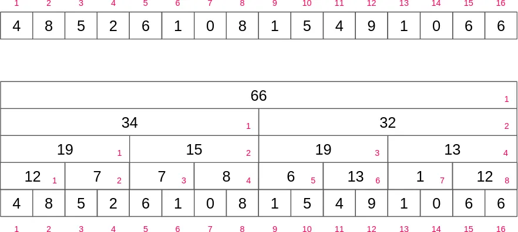
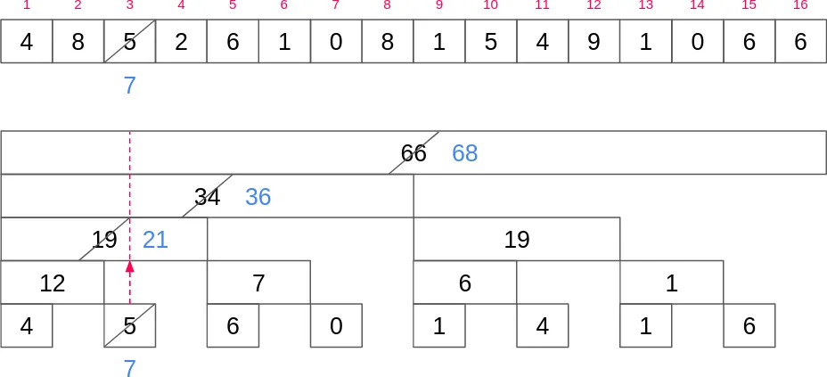

# Fenwick Tree (Binary Indexed Tree)

## Use cases

- Update elements and evaluate range queries in arrays

## Naive solutions

### Direct updates in the array

- Updates `O(1)`
- Query `O(r-l)`

Just sum all elements everytime a sum is made and make updates directly into the array

### Store sums in a secondary array

- Updates `O(arr.length)`
- Query `O(1)`

- Create a second array that in each position it stores the sum from the index 0 into this position
- To get a query, return the difference between `r` and `l-1` position values O(1)

## Fenwick Tree

### Conception

First, we need to create an intermediary bynary tree for which each node contains the sum for a segment of the array

- `Root` - Sum of the entire array
- `Root left child` - Sum of the first half
- `Root right child` - Sum of the second half
- And so on...

#### Query operation

- To sum the first n elements in that structure, we can get the node in the position and sum with the largest predecessor of it
- The even indexes can be ignored, as the block above it will express the sum including it, without need to add the block itself

For example if we want to get the sum up to position 13 `(1101)`.
We can use binary to check wich positions we need to sum

- `1101` - 8 + 4 + 0 + 1
- 34 + 19 + 1 = 54

Ignoring the even indexes is equivalent to `carry-over` on the binary representation of an array index

Simulating an operation to query on 13 position

n = 13
res = 0 + 1
n -= lsb(n) = 1100 = 4

n = 4
res = 1 + 19
n -= lsb(n) = 1000 = 8

n = 8
res = 20 + 34
n -= lsb(n) = 0000 = 0

res = 54

#### Update operation

All elements above a leaf node contains the leaf value in its sum.
On updates, we first update the value of the leaf and then update all nodes above it.

##### Walking on the three

Each index of the tree can be decomposed into:
`(1010)`

- Prefix: everything before least significant bit `(10)`
- Suffix: everything after least significant bit (including it) `(10)`

- The prefix indicates the order of that index in the level
- The suffix indicates the size of the block (how many nodes it covers)

##### The update

Notice that when a node A which prefix length is smaller than the other B, it means A is an ancestor of B

- A is above B if it's possible to from B to A by one or more zeros and one or more ones
- B is immediately above A if it is possible to go from B to A through one zero and one or more ones

To update a value, we need to move from B to A (immediately above)
To do that we sum the index with its least significant bit

Update:

i = 3
val = 7

add(3-1, 7-5) = add(2,2)

fenwick[2] = 19 + 2
i += lsb(i) = 4

fenwick[4] =

## Questions

- Why it has to be 1-indexed?
